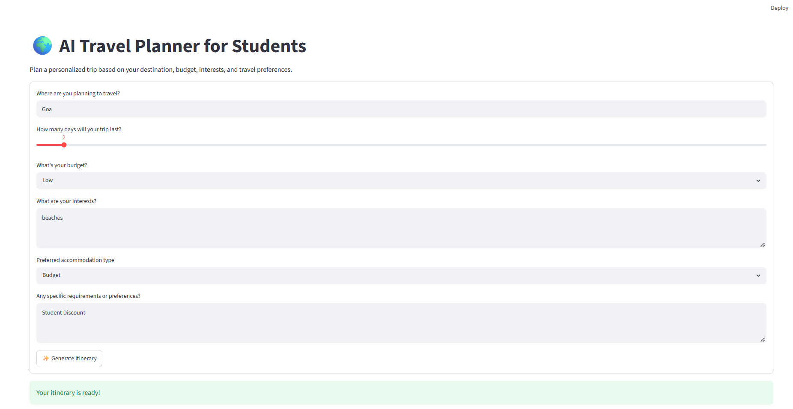

# 🌍 AI Travel Planner for Students

Planning trips is time-consuming and expensive, especially for students on a tight budget. This web app uses Google Gemini to generate personalized, budget-friendly, day-by-day travel itineraries.

## 🚀 Features
- **Personalized itineraries** based on destination, trip length, budget, interests and accommodation preference
- **Day-by-day plan** with morning, afternoon and evening activities
- **Food, accommodation and transport suggestions**
- **Estimated budget breakdown** (stay, food, transport, activities)
- **Student travel tips**, including discounts
- **Automatic retry** when the AI service is busy

## 🛠️ Tech Stack
- **Python**
- **Streamlit**: web interface
- **Google Gemini API** (`google-genai` SDK): itinerary generation

## 💻 How to Run Locally

**1. Clone the repository**
```bash
git clone https://github.com/Bhukya-jashwanthi/ai-travel-planner-students.git
cd ai-travel-planner-students
```

**2. Install dependencies**
```bash
pip install -r requirements.txt
```

**3. Add your Gemini API key**

Get a free key from [Google AI Studio](https://aistudio.google.com/). Then create a file `.streamlit/secrets.toml`:
```toml
GEMINI_API_KEY = "your-api-key-here"
```
> ⚠️ Never commit this file. It is already listed in `.gitignore`.

**4. Run the app**
```bash
streamlit run app.py
```

## 📸 Screenshot


## ⚠️ Disclaimer
AI-generated prices, opening hours and availability may be inaccurate. Always verify details before booking.
